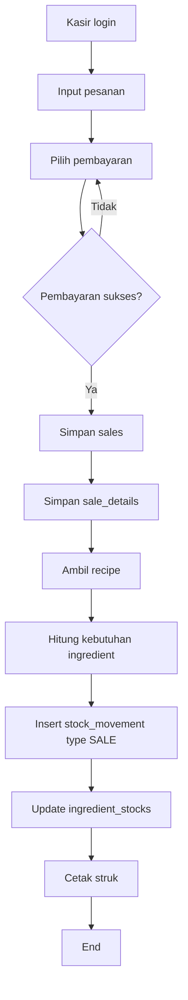
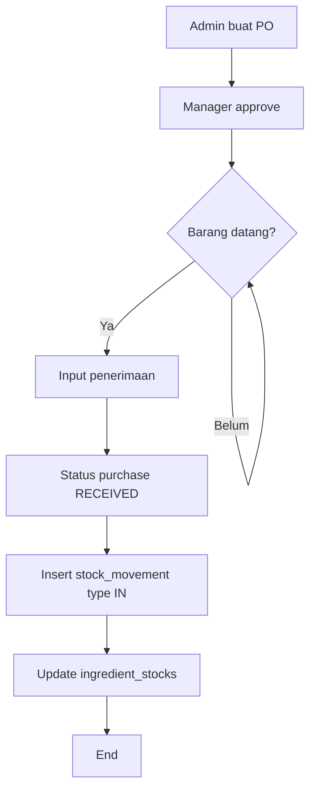
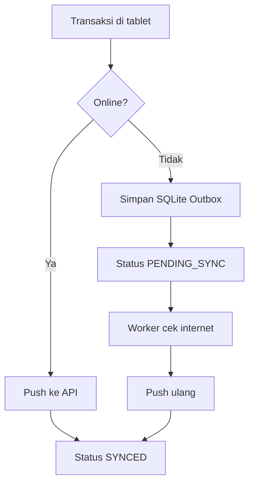

# Flowchart Mermaid - POS Coffee Shop

## Penjualan

```mermaid
flowchart TD
    A[Kasir login] --> B[Input pesanan]
    B --> C[Pilih pembayaran]
    C --> D{Pembayaran sukses?}
    D -- Tidak --> C
    D -- Ya --> E[Simpan sales]
    E --> F[Simpan sale_details]
    F --> G[Ambil recipe]
    G --> H[Hitung kebutuhan ingredient]
    H --> I[Insert stock_movement type SALE]
    I --> J[Update ingredient_stocks]
    J --> K[Cetak struk]
    K --> L[End]
```

## Pembelian

```mermaid
flowchart TD
    A[Admin buat PO] --> B[Manager approve]
    B --> C{Barang datang?}
    C -- Belum --> C
    C -- Ya --> D[Input penerimaan]
    D --> E[Status purchase RECEIVED]
    E --> F[Insert stock_movement type IN]
    F --> G[Update ingredient_stocks]
    G --> H[End]
```

## Sync Offline

```mermaid
flowchart TD
    A[Transaksi di tablet] --> B{Online?}
    B -- Ya --> C[Push ke API]
    C --> D[Status SYNCED]
    B -- Tidak --> E[Simpan SQLite Outbox]
    E --> F[Status PENDING_SYNC]
    F --> G[Worker cek internet]
    G --> H[Push ulang]
    H --> D
```
